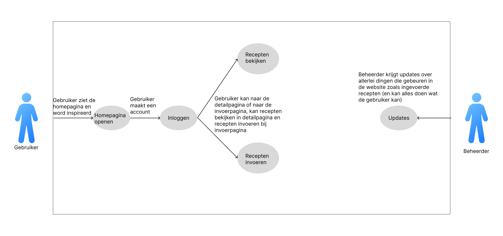

# Fase 3: Ideate (Oplossingen bedenken)

  

  

## 1. Concepten

  

* **How-Might-We vraag:** Hoe kunnen we er het beste voor zorgen dat de jongeren, door middel van deze website, meer getrokken voelen naar het zelf-koken.

  

* **Concept 1:** Een soort social media platform ontwikkelen met het aspect van het delen van eigen recepten. Jongeren zitten al vaak op verschillende social media, dus als we een beetje de kenmerken die de jongeren bezig houdt op die platformen toe kunnen passen, dan wordt het vanzelf een echte hit.0

  

* **Concept 2:** [Korte beschrijving]

  

  

## 2. Conceptkeuze & Onderbouwing

  

*Welk concept gaan we bouwen en waarom sluit dit het beste aan bij de PvE uit de Define fase?*

  

  

## 3. User Flow (Visueel)

  

